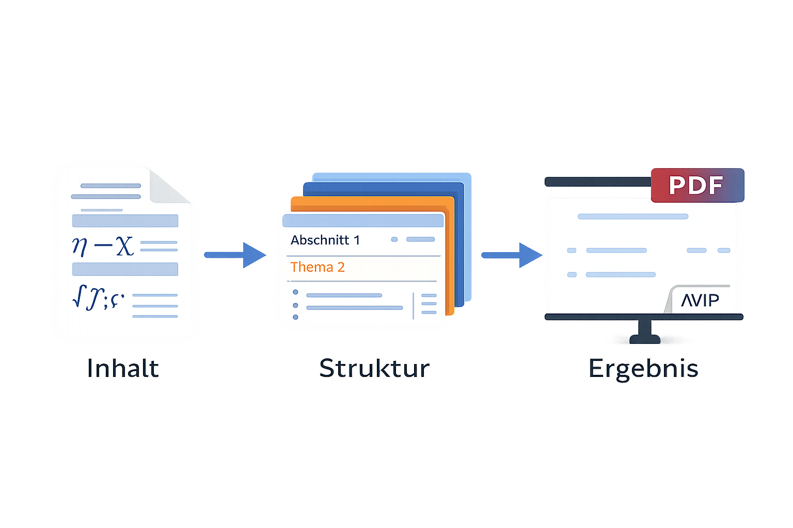
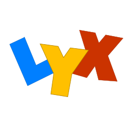
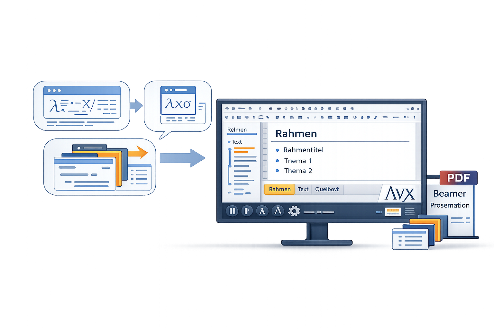
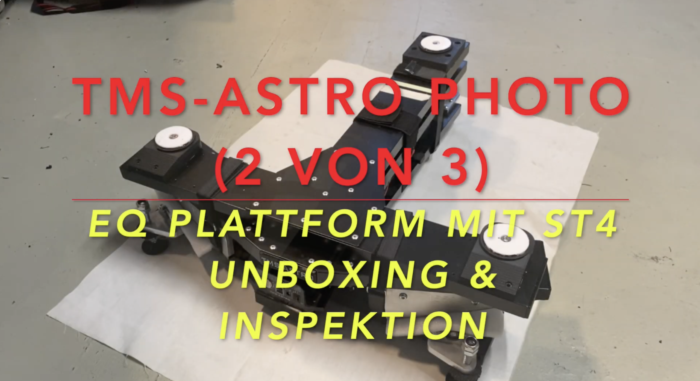
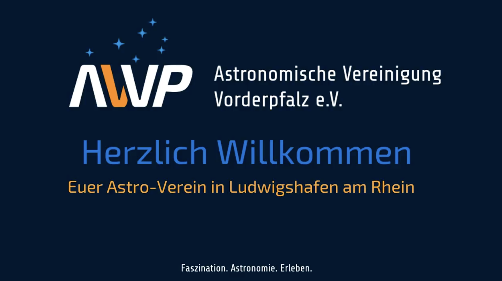
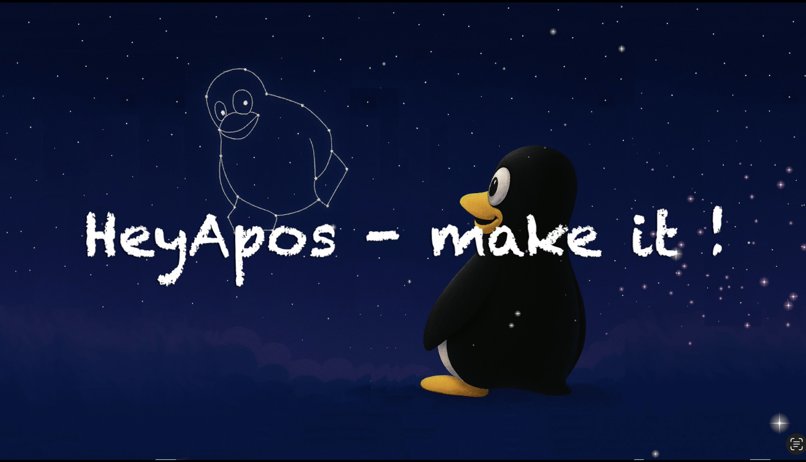

# Hauptthema bzw. Titel

**Titel 2. Zeile**  
*Untertitel, wenn vorhanden*

**Vereinsabend, 04.02.2026** – Astronomische Vereinigung Vorderpfalz e.V.

> Diese Seite ist eine lesbare Web-Zusammenfassung der Beamer-Präsentation. Die Struktur (Abschnitte/Unterabschnitte) folgt den Folien, der Text ist jedoch als Fließtext aufbereitet.

---

## Motivation

### Struktur

#### Strukturierte Vorträge

Einen Vortrag zu strukturieren ist nicht immer einfach. In der Praxis hilft es, die Inhalte konsequent zu vereinfachen, weil viele Zuhörerinnen und Zuhörer das Thema noch nicht im Detail kennen. Gerade bei knapper Zeit (z.\,B. 20 Minuten) ist es sinnvoll, sich auf eine klare Hauptbotschaft zu konzentrieren und Details wegzulassen – auch wenn das an einzelnen Stellen Vereinfachungen oder Ungenauigkeiten bedeutet. Was fachlich wichtig ist, aber nicht auf die Folien passt, kann man immer noch mündlich erläutern.

#### Strukturierte Vorträge (2)

Auch die Grobstruktur sollte zu einem klaren Ziel führen: Inhalte werden in wenige, gut unterscheidbare Blöcke gegliedert. Bewährt hat sich, neben einer Zusammenfassung nur zwei bis drei Hauptabschnitte zu verwenden und pro Abschnitt höchstens drei Unterabschnitte zu planen. Als grobe Daumenregel gilt: Wenn man pro Folie („Rahmen“) etwa 30 Sekunden bis zwei Minuten spricht, ergibt das insgesamt ungefähr 15 bis 30 Folien.

### LaTeX und LyX

#### Warum LaTeX Beamer für Präsentationen?



LaTeX Beamer trennt Inhalt und Layout sauber voneinander. Dadurch entsteht automatisch ein einheitliches Erscheinungsbild über alle Folien hinweg, und die Gliederung über Abschnitte, Unterabschnitte und Agenda lässt sich zuverlässig aus dem Dokument ableiten. Besonders stark ist Beamer dort, wo Formeln, Abbildungen und Quellenangaben eine Rolle spielen. Weil die Präsentation als Textdatei vorliegt, lässt sie sich gut versionieren und bleibt langfristig reproduzierbar.

#### Warum LyX in Kombination mit Beamer?






LyX ergänzt Beamer durch eine grafische Oberfläche: Inhalte können erstellt werden, ohne ständig LaTeX-Code tippen zu müssen. Gleichzeitig bleibt die Struktur strikt, weil Dokument, Abschnitte und Folien sauber getrennt sind. Das erleichtert Zusammenarbeit und spätere Pflege – und trotzdem ist die volle LaTeX-Leistung jederzeit verfügbar, wenn man sie braucht.

---

## Text

### Aufzählungen

#### Itemize und Statements

Untertitel sind optional; sie können einen Abschnitt kurz einordnen, sollten aber nicht vom Kern ablenken. Für Aufzählungen gilt: Man darf sie ruhig häufig einsetzen, sollte aber sehr knapp formulieren (am besten als Satzglieder oder kurze Ein-Satz-Punkte). In der Beamer-Version werden solche Listen oft schrittweise eingeblendet, auf einer Webseite liest man sie dagegen am besten ohne Einblendlogik.

Wenn eine feste Reihenfolge wichtig ist, eignen sich nummerierte Listen – etwa für Schritt-für-Schritt-Anleitungen.

#### Konzentration auf einzelne Punkte

In Beamer lassen sich Inhalte auch über Overlay-Spezifikationen in einer frei wählbaren Reihenfolge einblenden. Für eine Webfassung ist das nicht relevant: Hier stehen die Aussagen ohne zeitliche Steuerung direkt hintereinander und können in einem Zug gelesen werden.

### Spezielle Umgebungen

#### Satz / Folgerung

Auf Folien helfen Theorem- und Corollary-Umgebungen, Aussagen optisch zu strukturieren. In einer Webfassung kann man diesen Inhalt als kurze Kernaussagen lesen – zunächst die Hauptaussage („Theorem“), danach die unmittelbare Folgerung („Corollary“).

#### Blocks

„Blöcke“ sind in Beamer vor allem eine visuelle Klammer für zentrale Punkte. Ein normaler Block enthält typischerweise eine Aussage, die über alle Einblendstufen hinweg sichtbar bleibt. Ein Beispielblock kann – wie in der Vorlage – auch kurze mathematische Beispiele zeigen, etwa $e^{i\pi}=-1$ und $e^{i\pi/2}=i$.

#### Definitionen

Definition, Beispiel und Beweis sind eine sehr robuste Mini-Struktur, um Inhalte nachvollziehbar aufzubauen: Zuerst wird ein Begriff sauber definiert, dann illustriert ein Beispiel die Idee, und anschließend zeigt ein kurzer Beweis oder eine Begründung, warum die Aussage gilt.

#### Quellcode

Codebeispiele sollten so gesetzt werden, dass sie „wörtlich“ erscheinen (verbatim/listing). Wichtig ist in Beamer außerdem: Folien mit Programmlistings brauchen üblicherweise die Option `fragile`, damit die Kompilierung nicht an verbatim-Inhalten scheitert.

Beispiel:

```tex
\begin{itemize}
\item $e^{i\pi}=-1$.
\item $e^{i\pi/2}=i$.
\end{itemize}
```

---

## Tabellen

### Alleinstehend

#### Tabelle mit Überschrift

Tabellen eignen sich, wenn Werte oder Begriffe kompakt vergleichbar sein sollen. In der Vorlage wird eine einfache Tabelle gezeigt; in echten Inhalten sollte man auf klare Spaltenüberschriften, konsistente Einheiten und eine gut lesbare Gestaltung achten.

---

## Medien

### Einzelnes Bild


Ein einzelnes Bild wirkt am stärksten, wenn es für sich stehen darf. Für Veröffentlichungen ist zusätzlich wichtig, dass der Quellennachweis sauber geführt wird.

### Bild mit Text

#### Bild mit Überschrift

Wenn Bild und Text gemeinsam gezeigt werden, hilft eine kurze Überschrift, den Blick zu lenken. In Beamer kann man dafür Folien so konfigurieren, dass alles „in einem Rutsch“ erscheint; in der Webfassung entspricht das einem kompakten Abschnitt mit Bild und erklärendem Text.


#### Bild ohne Überschrift („plain“)

Ohne Überschrift liegt der Fokus ganz auf der Abbildung. Das ist dann sinnvoll, wenn das Bild selbst bereits selbsterklärend ist oder im Vortrag die Erklärung primär gesprochen wurde.

#### Bild im Hintergrund

Ein Hintergrundbild kann Atmosphäre schaffen und als visuelle Klammer dienen, während der Text im Vordergrund steht. Für die Webfassung ist das eher ein Gestaltungsthema; inhaltlich bleibt entscheidend, dass Bild und Text zusammenpassen und die Lesbarkeit gewahrt bleibt.

#### Gif

Viele PDF-Viewer können animierte GIFs nicht zuverlässig anzeigen. Daher arbeitet die Vorlage mit einem Vorschaubild, das auf die lokale Datei verweist.

Vorschau:


---

## Videos

#### Video per YouTube-Link

Poster:



Link (Text): https://www.youtube.com/watch?v=eTOM_303DC8

#### Google Drive Link

Poster:



Link (Text): https://drive.google.com/file/d/1erqrKUuNd9FtK19vyPEFOcITf_D7LrFN/view?usp=sharing

#### Lokale Videodatei

Poster:



Hinweis: Lokale Videodateien funktionieren je nach Viewer/Hosting unterschiedlich; für die Veröffentlichung im Web ist meist ein sauberer Upload/Einbettungs-Workflow sinnvoller als „Dateilinks“.

---

## Zusammenfassung

Am Ende sollten die Kernaussagen sehr knapp zusammengeführt werden: eine erste Hauptbotschaft, eine zweite Hauptbotschaft und – falls nötig – eine dritte. Mehr als drei Punkte verwässern die Zusammenfassung meist.

Ein kurzer Ausblick rundet das Ganze ab, indem offene Fragen und mögliche nächste Schritte benannt werden.